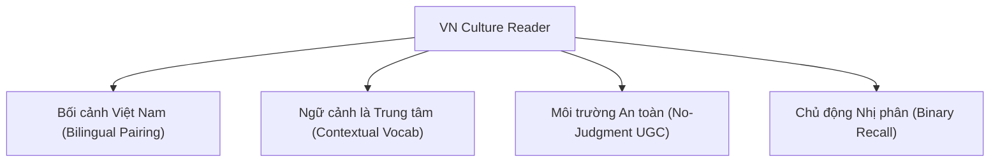

# 🌟 Tầm Nhìn & Mục Tiêu Dự Án (Vision & Goals)

## 1. Tổng Quan Dự Án
**VN Culture Reader** là nền tảng EdTech học tiếng Anh độc đáo, tiên phong trong việc sử dụng **bối cảnh văn hóa, lịch sử, danh lam thắng cảnh và đời sống Việt Nam** làm tài liệu luyện đọc và tiếp thu ngôn ngữ.

Khác với các ứng dụng học tiếng Anh truyền thống sử dụng ngữ cảnh phương Tây hoặc đề tài chung chung, **VN Culture Reader** giúp người học Việt Nam:
1. Tiếp thu tiếng Anh thông qua những chủ đề gần gũi, quen thuộc và tự hào.
2. Nâng cao khả năng diễn đạt, giới thiệu văn hóa Việt Nam ra thế giới bằng tiếng Anh chuẩn học thuật.
3. Học tự nhiên trong ngữ cảnh (Contextual Learning) kết hợp phương pháp Luyện nghe Shadowing và Thẻ nhớ Flashcards.

---

## 2. Tầm Nhìn (Vision)
Xây dựng một hệ sinh thái học ngôn ngữ tích hợp văn hóa hàng đầu, nơi người học không chỉ giỏi tiếng Anh mà còn trở thành những **"Sứ giả Văn hóa" (Cultural Ambassadors)** tự tin chia sẻ góc nhìn và cảm nghĩ cá nhân mà không sợ bị phán xét hay sửa lỗi.

---

## 3. Mục Tiêu Sản Phẩm (Product Goals)

### 3.1. Đối với Người Học (Learner Experience Goals)
- **Xóa bỏ rào cản tâm lý e ngại**: Tạo môi trường viết cảm nghĩ (Reflections) hoàn toàn tự do, không áp lực điểm số hay sửa lỗi ngữ pháp.
- **Tối ưu khả năng ghi nhớ dài hạn**: Áp dụng thẻ nhớ 2 mặt (Flashcards) lưu trữ từ vựng cùng câu ngữ cảnh gốc và đánh giá nhị phân (*Đã nhớ / Cần ôn lại*).
- **Phát triển kỹ năng phát âm & phản xạ**: Cung cấp luồng âm thanh AI chuẩn bản xứ cho từng bài đọc phục vụ phương pháp Shadowing.

### 3.2. Đối với Hệ Thống & Kinh Doanh (Product & Business Goals)
- **Giai đoạn MVP (Web App)**: Đảm bảo luồng trải nghiệm hoàn chỉnh từ Đọc bài song ngữ -> Học từ vựng theo ngữ cảnh -> Ôn Flashcard -> Đăng Reflection.
- **Giai đoạn Mở rộng (Mobile Web App & Native App)**: Tối ưu UI/UX dạng thẻ vuốt di động, hỗ trợ học mọi lúc mọi nơi.
- **Gợi mở cộng đồng (UGC Network)**: Khuyến khước người dùng tạo nội dung (UGC), kết nối và tương tác thông qua cảm xúc và thả tim (Reactions).

---

## 4. Chân Dung Người Dùng Mục Tiêu (User Personas)

| Persona | Đặc điểm & Nhu cầu | Rào cản hiện tại | Giải pháp từ VN Culture Reader |
| :--- | :--- | :--- | :--- |
| **Sinh viên / Người đi làm (Intermediate)** | Muốn luyện đọc hiểu báo chí/tài liệu học thuật, trau dồi từ vựng tự nhiên. | Nản lòng khi học từ vựng đơn lẻ, thiếu câu thực tế. | Bài đọc chuẩn song ngữ + Từ vựng trích xuất kèm câu ngữ cảnh gốc. |
| **Người e ngại phát âm / nói tiếng Anh** | Muốn cải thiện ngữ điệu và khả năng giao tiếp. | Ngượng ngùng khi phát âm sai, sợ bị phán xét. | Luyện nghe Shadowing với AI Audio chuẩn bản xứ. |
| **Người yêu văn hóa & Viết lách** | Thích chia sẻ cảm xúc, suy nghĩ về bài học/văn hóa. | Sợ viết sai ngữ pháp, bị chấm điểm thấp. | Tính năng Reflections: Viết tự do, không chấm điểm, gợi ý từ vựng nhanh. |

---

## 5. Các Trụ Cột Triết Lý Nghiệp Vụ (Core Business Pillars)

