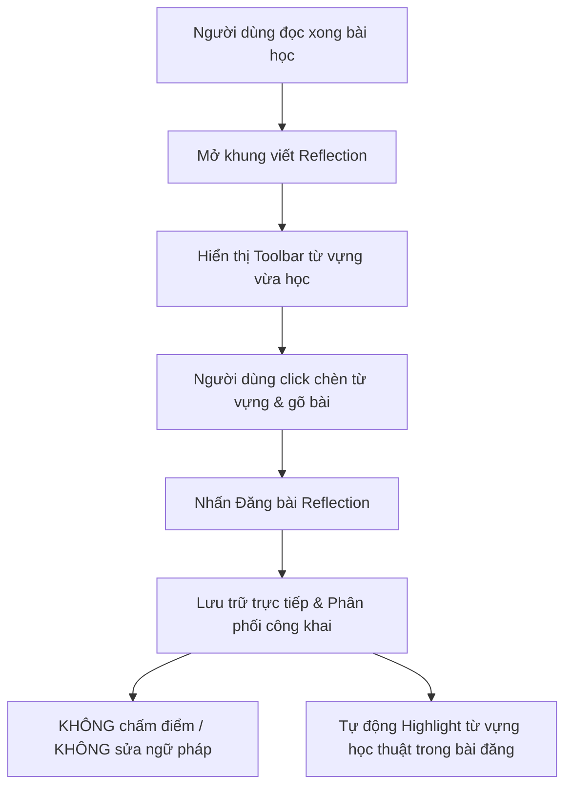

# 📜 Quy Tắc Nghiệp Vụ BR-03: Cảm Nghĩ Cộng Đồng (Reflections / UGC)

## 1. Mục Đích & Phạm Vi
Quy định cơ chế đăng tải cảm nghĩ cá nhân (Reflections), công cụ chèn từ vựng nhanh, quy tắc phân phối nội dung do người dùng tạo ra (UGC) và triết lý "Môi trường học tập không phán xét".

---

## 2. Các Quy Tắc Nghiệp Vụ Cốt Lõi (Core Business Rules)

### BR-03.1: Đăng Tải Cảm Nghĩ & Chèn Từ Vựng Nhanh (Reflection Creation & Quick Insertion)
- **Quy tắc 3.1.1**: Sau khi hoàn thành bài đọc, hệ thống mở giao diện cho phép người dùng đăng tải bài viết cảm nghĩ ngắn (Reflection) liên quan đến chủ đề bài học.
- **Quy tắc 3.1.2**: Hệ thống cung cấp **Công cụ chèn nhanh từ vựng (Quick Vocab Insertion Toolbar)**. Khi nhấp vào danh sách từ vựng vừa học của bài đọc, từ đó sẽ tự động chèn vào vị trí con trỏ trong khung soạn thảo của người dùng.

### BR-03.2: Nghiệp Vụ Cốt Lõi: Cấm Tuyệt Đối Thuật Toán Chấm Điểm & Sửa Lỗi Ngữ Pháp
- **Quy tắc 3.2.1**: **Tuyệt đối KHÔNG áp dụng bất kỳ thuật toán AI/Machine Learning nào để chấm điểm, xếp loại, đánh giá độ chính xác hay tự động sửa lỗi ngữ pháp/chính tả** trên bài viết Reflection của người dùng.
- **Lý do Nghiệp vụ (Business Rationale)**: Loại bỏ triệt để rào cản tâm lý "sợ sai ngữ pháp", "sợ điểm thấp", khuyến khích người học tự tin diễn đạt suy nghĩ cá nhân một cách tự nhiên nhất.

### BR-03.3: Phân Phối Cộng Đồng & Tương Tác (Public Distribution & Reactions)
- **Quy tắc 3.3.1**: Mọi bài viết Reflection mặc định được phân phối công khai trên dòng thời gian bài học (Lesson Activity Feed).
- **Quy tắc 3.3.2**: Hệ thống hỗ trợ ghi nhận và hiển thị số lượng tương tác cảm xúc (**Reactions / Thả tim**) từ các người dùng khác để động viên tinh thần chia sẻ.

### BR-03.4: Duy Trì Nhận Diện Từ Vựng Học Thuật Trong UGC (UGC Vocab Detection)
- **Quy tắc 3.4.1**: Hệ thống phải tự động quét và nhận diện các **từ vựng học thuật** xuất hiện trong bài viết Reflection của người dùng (bao gồm cả các từ thuộc bài đọc vừa học hoặc các bài đọc trước đó).
- **Quy tắc 3.4.2**: Các từ vựng học thuật được phát hiện trong UGC sẽ được **tự động highlight/gạch chân** và trở thành liên kết tương tác (interactive link) để hiển thị thông tin giải nghĩa khi click vào.

---

## 3. Luồng Soạn Thảo Cảm Nghĩ (Reflection Flow Chart)

---

## 4. Tác Động Đến Các Bộ Phận (Cross-Functional Impact)

- 📣 **Marketing & Community Manager**: Sử dụng thông điệp *"Học tiếng Anh không lo bị chấm điểm/sửa lỗi"* làm định vị thương hiệu cốt lõi.
- ⚙️ **Backend & AI Dev**: Không xây dựng pipeline Grammar Checker cho Reflection. Xây dựng dịch vụ nhẹ (Lemmatizer/Keyword Matcher) để quét từ vựng học thuật trong văn bản UGC của người dùng.
- 🎨 **UI/UX Designer**: Thiết kế Toolbar từ vựng ngay phía trên/dưới khung gõ văn bản, hỗ trợ 1-click insertion.
