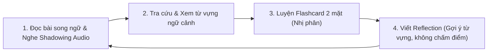

# 📜 Quy Tắc Nghiệp Vụ BR-05: Luồng Trải Nghiệm & Luồng Dữ Liệu Tổng Quan

## 1. Mục Đích & Phạm Vi
Định hình vòng đời học tập (Learning Loop) của người dùng từ khi bắt đầu chọn bài đọc cho đến khi hoàn thành bài học và đóng góp cảm nghĩ cho cộng đồng.

---

## 2. Vòng Đời Học Tập Cốt Lõi (Core Learning Loop)

Vòng đời học tập trên **VN Culture Reader** gồm 4 bước khép kín:

### Bước 1: Khám Phá Bài Đọc (Reading & Shadowing)
- Người dùng chọn bài đọc thuộc chủ đề văn hóa Việt Nam (ví dụ: *Huế, Phố cổ Hội An, Bánh mì Việt Nam...*).
- Đọc bài dưới dạng cặp đoạn văn song ngữ (tiếng Anh chính, tiếng Việt hỗ trợ).
- Bật Audio AI bản xứ để nghe và nhại theo (Shadowing).

### Bước 2: Khám Phá Từ Vựng (Vocabulary Discovery)
- Người dùng bấm vào các từ vựng học thuật được highlight trong bài.
- Xem popup giải nghĩa kèm **câu ngữ cảnh gốc**.
- Hệ thống tự động thêm các từ này vào danh sách thẻ nhớ ôn tập của bài học.

### Bước 3: Ôn Tập Chủ Động (Active Recall via Flashcard)
- Người dùng chuyển sang màn hình Flashcards của bài đọc.
- Lật thẻ xem từ vựng + câu ngữ cảnh -> lật mặt sau xem nghĩa & nghe audio.
- Bấm tự đánh giá 🟢 **"Đã nhớ"** hoặc 🔴 **"Cần ôn lại"**.

### Bước 4: Viết Cảm Nghĩ & Tương Tác (Reflections & Community)
- Người dùng mở khung viết Reflection.
- Nhấp công cụ gợi ý từ vựng vừa học để chèn nhanh vào bài viết.
- Đăng bài lên feed công khai mà **không sợ bị chấm điểm hay sửa lỗi ngữ pháp**.
- Đọc và thả tim bài viết cảm nghĩ của người dùng khác.

---

## 3. Tiêu Chí Hoàn Thành Bài Học (Lesson Completion Criteria)

- **Quy tắc 5.1**: Một bài đọc được tính là **"Đã hoàn thành" (Completed)** khi người dùng đáp ứng đủ 2 điều kiện bắt buộc:
  1. Đã lật qua tất cả các Flashcard từ vựng của bài học đó ít nhất 1 lần.
  2. Đã bấm tự đánh giá cho toàn bộ từ vựng.
- **Quy tắc 5.2**: Việc đăng bài Reflection là **không bắt buộc (Optional)** để tính tỷ lệ hoàn thành bài học, nhưng được khuyến khước bằng huy hiệu thưởng hoặc cộng điểm tương tác (Community Karma Points).

---

## 4. Tác Động Đến Các Bộ Phận (Cross-Functional Impact)

- 🎨 **UI/UX Designer**: Thiết kế thanh tiến độ bài học (Progress Bar) phản ánh rõ 4 bước trong Vòng đời học tập.
- ⚙️ **Developers**: Quản lý trạng thái bài học của người dùng (`not_started`, `in_progress`, `completed`).
- 📊 **Marketing**: Xây dựng nội dung truyền thông về "Vòng lặp học tập 4 bước chuẩn khoa học nhưng không áp lực".
