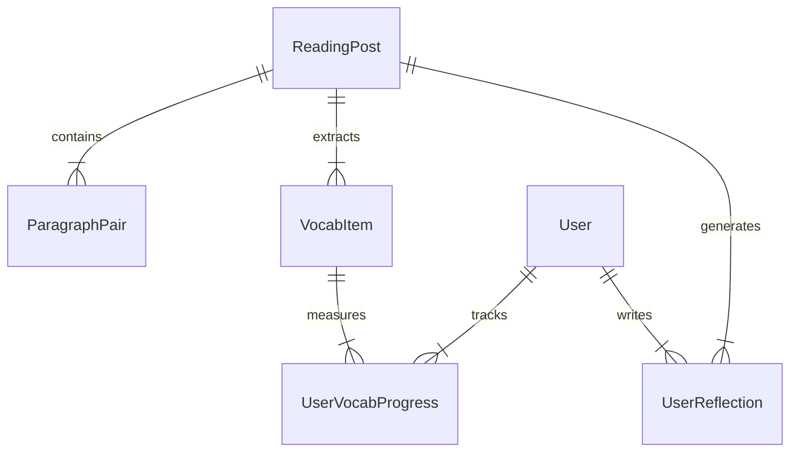

# 🗄️ Từ Điển Dữ Liệu Hệ Thống (System Data Dictionary)

Tài liệu quy định cấu trúc dữ liệu, các thực thể (Entities), thuộc tính (Attributes) và mối quan hệ (Relationships) dùng cho Database Schema và API Contracts giữa FE/BE/AI Agents.

---

## 1. Sơ Đồ Thực Thể Quan Hệ (ERD Concept)

---

## 2. Thực Thể `ReadingPost` (Bài Đọc)

| Trường (Field) | Kiểu dữ liệu | Mô tả & Quy tắc |
| :--- | :--- | :--- |
| `id` | `String` (UUID) | Khóa chính của bài đọc. |
| `title_en` | `String` | Tiêu đề tiếng Anh của bài đọc. |
| `title_vi` | `String` | Tiêu đề tiếng Việt dịch tương ứng. |
| `topic` | `String` | Chủ đề (ví dụ: *History, Cuisine, Heritage, Festival...*). |
| `shadowing_audio_url` | `String` (URL) | Đường dẫn file âm thanh AI Shadowing đọc toàn bộ bài bài đọc. |
| `level` | `Enum` | Trình độ bài đọc (`B1`, `B2`, `C1`). |
| `created_at` | `Timestamp` | Thời gian tạo bài đọc. |

---

## 3. Thực Thể `ParagraphPair` (Cặp Đoạn Song Ngữ)

| Trường (Field) | Kiểu dữ liệu | Mô tả & Quy tắc |
| :--- | :--- | :--- |
| `id` | `String` (UUID) | ID đoạn văn. |
| `post_id` | `String` (FK) | Mã liên kết với `ReadingPost`. |
| `order_index` | `Integer` | Thứ tự đoạn văn trong bài đọc (0, 1, 2...). |
| `en_text` | `Text` | Văn bản đoạn tiếng Anh (Dữ liệu chính). |
| `vi_text` | `Text` | Văn bản đoạn tiếng Việt (Dữ liệu phụ trợ). |
| `audio_timestamp_start` | `Float` | Mốc giây bắt đầu trong file audio bài đọc. |
| `audio_timestamp_end` | `Float` | Mốc giây kết thúc trong file audio bài đọc. |

---

## 4. Thực Thể `VocabItem` (Từ Vựng Ngữ Cảnh)

| Trường (Field) | Kiểu dữ liệu | Mô tả & Quy tắc |
| :--- | :--- | :--- |
| `id` | `String` (UUID) | ID từ vựng. |
| `post_id` | `String` (FK) | Mã liên kết với bài đọc xuất bản từ này. |
| `word` | `String` | Từ gốc tiếng Anh. |
| `ipa` | `String` | Phiên âm quốc tế IPA. |
| `pos` | `String` | Từ loại (*noun, verb, adj, adv...*). |
| `vi_meaning` | `String` | Nghĩa tiếng Việt theo ngữ cảnh. |
| `context_sentence` | `Text` | **Bắt buộc**: Nguyên văn câu tiếng Anh chứa từ trong bài đọc. |
| `audio_url` | `String` (URL) | File phát âm từ vựng đơn lẻ. |

---

## 5. Thực Thể `UserReflection` (Cảm Nghĩ Người Dùng - UGC)

| Trường (Field) | Kiểu dữ liệu | Mô tả & Quy tắc |
| :--- | :--- | :--- |
| `id` | `String` (UUID) | ID bài viết cảm nghĩ. |
| `user_id` | `String` (FK) | Mã người tạo bài viết. |
| `post_id` | `String` (FK) | Bài đọc liên quan. |
| `content` | `Text` | Nội dung cảm nghĩ của người dùng. |
| `used_vocab_ids` | `Array[String]` | Danh sách ID từ vựng đã chèn/nhận diện được trong bài. |
| `reactions_count` | `Integer` | Số lượt thả tim / tương tác (mặc định = 0). |
| `status` | `Enum` | `published` (Đăng ngay) \| `pending_review` (Do chứa từ nhạy cảm). |
| `created_at` | `Timestamp` | Thời gian đăng. |

---

## 6. Thực Thể `UserVocabProgress` (Tiến Độ Flashcard)

| Trường (Field) | Kiểu dữ liệu | Mô tả & Quy tắc |
| :--- | :--- | :--- |
| `user_id` | `String` (FK) | ID người dùng. |
| `vocab_id` | `String` (FK) | ID từ vựng. |
| `status` | `Enum` | `learning` (Cần ôn lại) \| `mastered` (Đã nhớ). |
| `review_count` | `Integer` | Số lần đã lật ôn tập. |
| `last_reviewed_at` | `Timestamp` | Thời điểm đánh giá nhị phân gần nhất. |
